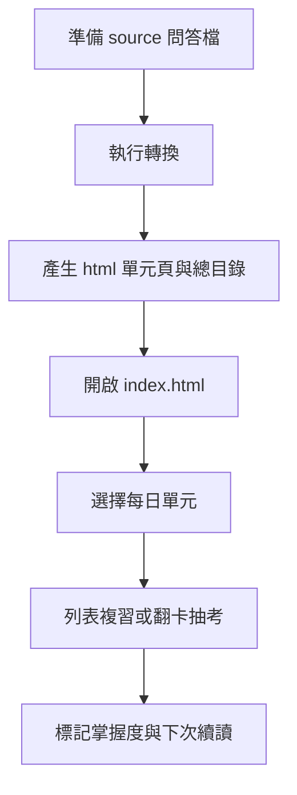
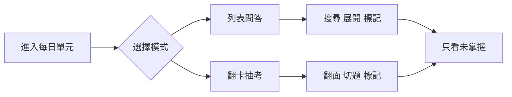
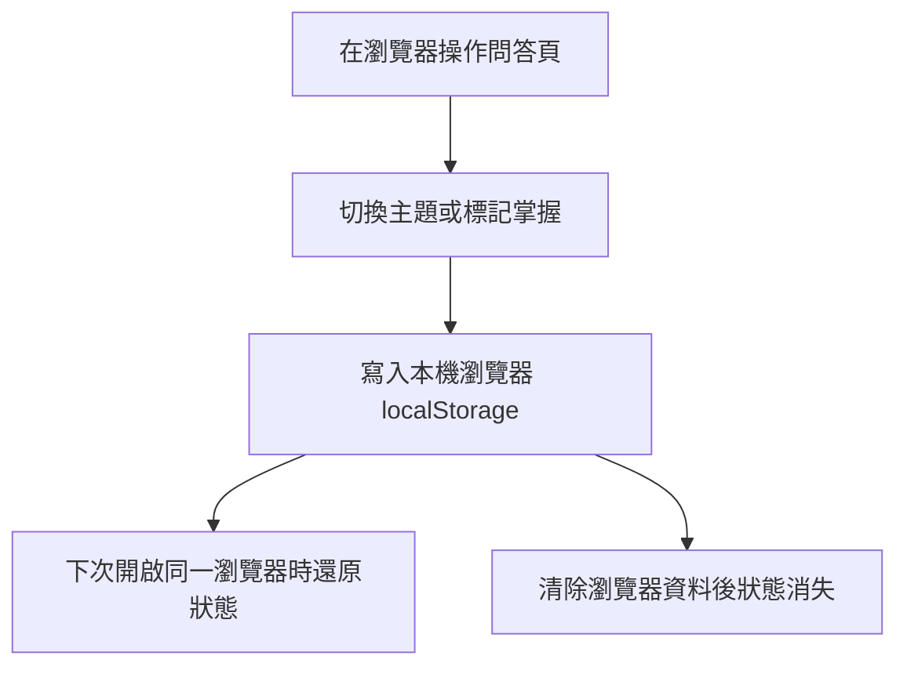

# 30 天數據思維問答卡使用者操作手冊

本專案可把 `source/` 內的 Anki 風格問答文字檔，轉換成可直接用瀏覽器開啟的互動式 QA 學習頁。使用者可以從總目錄選擇每日單元，透過列表展開、搜尋、翻卡抽考、隨機排序與掌握度標記來複習 30 天數據分析教材。

## 目錄

- [快速開始](#快速開始)
- [整體使用流程](#整體使用流程)
- [檔案與頁面位置](#檔案與頁面位置)
- [準備問答來源檔](#準備問答來源檔)
- [產生或更新學習頁](#產生或更新學習頁)
- [使用總目錄與每日問答頁](#使用總目錄與每日問答頁)
- [個人進度、外觀與資料安全](#個人進度外觀與資料安全)
- [調整網站標題與文案](#調整網站標題與文案)
- [常見問題](#常見問題)
- [維護者驗證](#維護者驗證)

## 快速開始

如果你只是要複習已經產生好的問答卡：

1. 開啟專案資料夾。
2. 直接用瀏覽器開啟根目錄的 `index.html`。
3. 點選「開始問答總目錄」進入 `html/index.html`。
4. 選擇 `Day01` 到 `Day30` 其中一個單元開始複習。

如果你修改了 `source/` 內的問答來源檔，請先重新產生 HTML：

```powershell
npm start
```

Windows 使用者也可以在檔案總管中雙擊 `convert.bat`。轉換完成後，再開啟 `index.html`。

## 整體使用流程



## 檔案與頁面位置

- `source/`：放置每日問答來源檔，例如 `Day01.txt`、`Day02.txt`。
- `html/`：放置轉換後的互動式問答頁，例如 `html/Day01.html`。
- `html/index.html`：每日單元總目錄，列出所有已轉換的問答頁。
- `index.html`：根目錄入口頁，負責連到 `html/index.html`。
- `qa.config.json`：調整網站標題、單元標題與卡片描述文案。
- `convert.bat`：Windows 雙擊執行用的轉換入口。
- `convert.js`：實際執行轉換的 Node.js 腳本。

## 準備問答來源檔

每一個來源檔代表一個學習單元，副檔名可使用 `.txt` 或 `.tsv`。每一行至少要有一個 Tab，格式如下：

```text
問題<Tab>答案
```

範例：

```text
什麼是描述性分析？	用統計摘要、圖表與指標描述資料目前的樣貌。
為什麼要先確認資料品質？	避免用缺漏、重複或定義錯誤的資料做出錯誤判斷。
```

使用注意事項：

- 空白行會被忽略。
- 第一個 Tab 前方會被視為問題。
- 第一個 Tab 後方的內容會被視為答案；答案內若還有 Tab，會一併保留。
- 檔名會成為單元名稱，例如 `source/Day01.txt` 會產生 `html/Day01.html`。

## 產生或更新學習頁

執行任一種方式即可重新轉換所有 `source/` 內的 `.txt` 與 `.tsv` 檔：

```powershell
npm start
```

或：

```powershell
npm run build
```

或不透過 npm：

```powershell
node --preserve-symlinks-main convert.js
```

重要提醒：轉換會重建 `html/*.html`、`html/index.html` 與根目錄 `index.html`。如果你手動改過產出 HTML，請先備份，否則重新轉換時會被新的輸出覆蓋。

## 使用總目錄與每日問答頁

### 總目錄

1. 開啟 `index.html`。
2. 點選入口按鈕進入 `html/index.html`。
3. 從卡片清單選擇要複習的每日單元。

### 列表問答模式

每日頁預設會進入列表模式。你可以：

- 點擊題目展開或收合答案。
- 使用搜尋框搜尋問題與答案文字。
- 點擊「展開全部」一次顯示全部答案。
- 點擊星號標記已掌握的題目。
- 啟用「只看未掌握」集中複習還沒熟悉的題目。
- 使用「隨機排序」打亂題目順序，或使用「恢復原順序」回到題號排序。

### 翻卡抽考模式

切換到翻卡模式後，你可以像使用單張抽認卡一樣複習：

- 點擊卡片或按「翻卡」查看答案。
- 使用上一題、下一題切換題目。
- 點擊星號標記目前題目是否已掌握。
- 使用隨機排序搭配翻卡模式進行抽考。

鍵盤快捷鍵：

- `Space`：翻面。
- `←`：上一題。
- `→`：下一題。
- `M`：標記或取消掌握。



## 個人進度、外觀與資料安全

學習頁會使用瀏覽器的 `localStorage` 保存兩類資料：

- `qa_theme`：亮色或深色外觀偏好。
- `anki_mastered_<單元名稱>`：各單元已標記掌握的題號。

資料保存流程如下：



隱私與離線注意事項：

- 問答內容來自本機 `source/` 檔案轉出的 HTML，不需要登入，也不會把學習進度上傳到伺服器。
- 若使用同一台電腦但不同瀏覽器，掌握度標記不會互通。
- 清除瀏覽器網站資料、使用無痕模式，或更換檔案路徑與瀏覽器環境，可能導致掌握度與主題偏好看起來像是消失。
- 問答頁載入 KaTeX CDN 來美化 LaTeX 公式；若完全離線或 CDN 被封鎖，主要問答功能仍可使用，但公式美化可能無法正常顯示。

## 調整網站標題與文案

若只想改總目錄標題、單元頁標題或卡片描述，請編輯 `qa.config.json`，不需要修改 `convert.js`。

目前可調整的欄位包含：

```json
{
  "siteTitle": "30天數據思維問答總目錄",
  "siteIcon": "❤️",
  "indexBrowserTitle": "30天數據思維問答總目錄",
  "indexSubtitle": "選擇學習單元以開始複習與自我測驗",
  "unitBrowserTitleTemplate": "{unit} - 問答複習卡",
  "unitHeadingTemplate": "{unit} 問答卡",
  "indexCardTitleTemplate": "{unit} 問答卡",
  "indexCardDescriptionTemplate": "包含 {count} 個核心觀念問題與解答，支援列表速覽與抽考測驗。"
}
```

可用模板變數：

- `{unit}`：來源檔名去除副檔名後的單元名稱，例如 `Day01`。
- `{count}`：該單元解析出的問答題數。

如果 `qa.config.json` 不存在、格式錯誤，或只填了部分欄位，轉換工具會使用內建預設值補齊。

## 常見問題

### 我新增了 `source/Day31.txt`，但總目錄沒有出現

請重新執行 `npm start` 或雙擊 `convert.bat`。總目錄與每日 HTML 是轉換後的產物，不會在你儲存來源檔時自動更新。

### 為什麼某一行沒有變成問答卡？

請確認該行包含 Tab，而且 Tab 前後都有內容。只有空白、缺少答案或缺少問題的行會被略過。

### 掌握度標記不見了

請確認你是否換了瀏覽器、開了無痕視窗、清除了網站資料，或把檔案移到不同位置後用不同方式開啟。掌握度只保存在目前瀏覽器的 `localStorage`。

### 公式沒有變漂亮

問答頁會從 CDN 載入 KaTeX。若目前沒有網路、公司網路封鎖 CDN，或瀏覽器阻擋外部資源，公式可能會以原始文字顯示。

### 可以直接修改 `html/Day01.html` 嗎？

不建議。`html/` 內的檔案是轉換產物，下次執行轉換時會被重建。請改 `source/Day01.txt` 或 `qa.config.json`，再重新產生 HTML。

## 維護者驗證

修改來源、設定或轉換腳本後，建議至少執行：

```powershell
npm test
```

交付前若需要確認完整輸出，請執行：

```powershell
npm run build
```

接著用瀏覽器開啟 `index.html`，檢查：

- 根目錄入口可連到 `html/index.html`。
- 總目錄列出預期的每日單元。
- 每日頁能切換列表與翻卡模式。
- 搜尋、展開全部、隨機排序、恢復原順序可正常操作。
- 掌握度標記與深色模式重新整理後仍會保留。

處理中文檔案時，Windows PowerShell 可用 UTF-8 方式讀回確認：

```powershell
[Console]::OutputEncoding=[System.Text.Encoding]::UTF8
[System.IO.File]::ReadAllText((Resolve-Path 'README.md'), [System.Text.Encoding]::UTF8)
```
